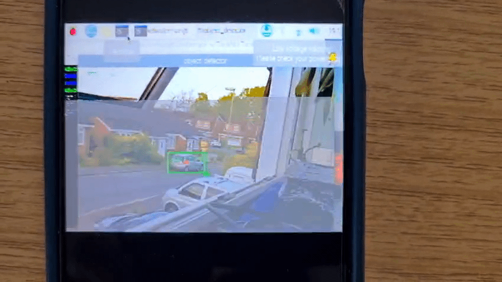

# Raspberry Pi Transmitter

## Introduction
Want wireless communication options for your Pi which do not rely IP? So did I. This project shows you how to hack together a Raspberry Pi 4 and a FPV video transmitter. This project was inspired by a few converging ideas, but principally on how you might facilitate wireless communications between a Pi and another device without using IP, whether that be WiFi or 4G. Given the ubiquity of FPV parts, this was the obvious place to start, and provides a simple and cheap alternative output option for your Pi.


This project was inspired by the one post I found when researching transmit options fo my Pi, which can be found [here](https://hackaday.io/project/12450-raspberry-pi-zero-fpv-camera-and-osd/log/51759-connecting-fpv-transmitter-to-pi-zero). In retrospect, this was about 90% of the solution, but hopefully I can offer some additional specificity which might be useful for others. 


## Requirements
### Hardware 
This project should be simple enough to generalise to other hardware, but to replicate what I did, please use the following:

1. A Raspberry Pi 4B
2. A AKK FX2-ultimate 5.8 GHz VTX
3. A SKYDROID 5.8 GHZ OTG Receiver
4. 7.4v battery pack for the VTX
5. A Pi compliant RCA cable 
6. An adapter cable for the battery pack to connect it directly to the VTX (I needed to convert Female JST to Male Deans T)


## Getting Setup
### The Fundamentals
The VTX module we are using is analog, so the key to making this work is getting a connection from the Pi's composite output to the VTX. If we keep that in mind, this is all relatively straightforward. 

### Two Output Options
The Pi comes with an AV jack as standard which offers one potential solution, but this will require some hackery of the RCA cable. A more generalisable solution, which can be used with other Pi boards, is to use the relevant test points on the back of the board. The messy example below shows an instance of this for a RP4B. In essence, you solder the video input of the VTX to the composite video output of the Pi and then ground the connection. 


I found these test points by consulting the documentation, which for the RPB4 can be found [here](https://datasheets.raspberrypi.com/rpi4/raspberry-pi-4-reduced-schematics.pdf). The downside to this is that the test points are not really meant to be used for permanent connections, which meant the general quality of the image was relatively poor. The GIF'd footage below is the result of the test point connection and not helped by the lazy use of an unmatched antenna. 



The more permanent fix is shown at the top of this project, and involves soldering the VTX video and ground connections to the 'yellow' RCA cable. This is straightforward and only entails cutting the cable connectors off, stripping the wires back, and soldering the two  together. This offered a far more stable connection, but won't be an option if you are using a Pi Zero. 

### Software Setup
The only software change is a `raspi-config` command to switch output modes from HDMI to composite. However, before you do this, please note this deactivates the HDMI output. This means you will need to use the composite output to re-set to HDMI, which can be a little painful when the resolution or signal is poor. 

```
sudo raspi-config nonint do_pi4video V2
```
### The Reciever
I used the SKYDROID 5.8GHz receiver with USB connector. This is designed for Android devices and requires an app to work, but offers an quick, easy, and cheap solution. The app I used was `USB Camera`, which worked fine, but is loaded with ads and probably not a permanent solution if you wanted to implement this form of connectivity for anything substantive. 

## Resetting
The first time I did this, I did not think about how I would reset the output to HDMI. This meant I had to use the received 240p image on my phone to navigate the command line with letters so fuzzy I struggled to tell what I was writing. It is worth taking a few minutes to figure out your solution to this... 
